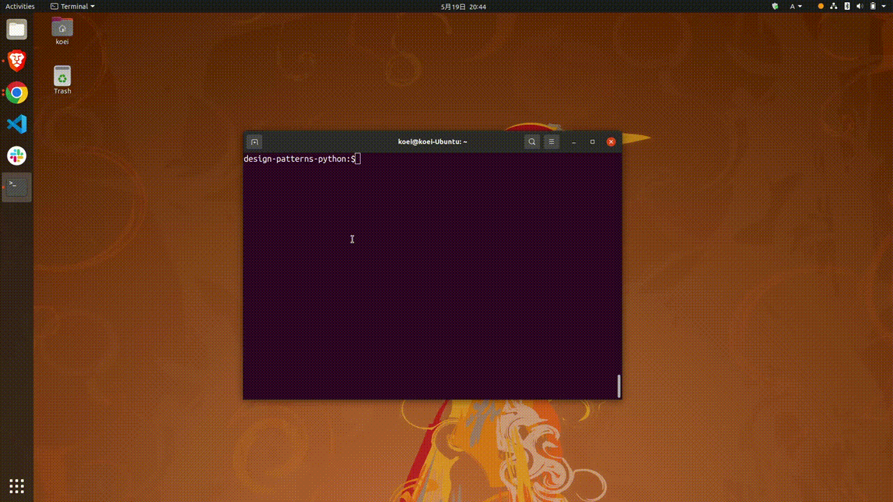

# design-patterns-python


[](https://www.python.org/downloads/release/python-3911/)


A collection of design patterns in Python.  
Source codes are independently rewritten from [the Mr. Hiroshi Yuki's book (増補改訂版Java言語で学ぶデザインパターン入門)](https://www.amazon.co.jp/dp/4797327030) that is mentioned in Java.  
Therefore, This repository is not described the detail of the process not to infringe on his writings and interests.  

## How to run

Just running individual tests by pattern.  

```bash
$./run.sh <pattern>

# Example)
./run.sh observer
```

### Example



## Built With

- [pydantic]: Data validation and settings management using Python type hints
- [multimethod]: Multimethod provides a decorator for adding multiple argument dispatching to functions
  - using for overload
- [matplotlib]: A comprehensive library for creating static, animated, and interactive visualizations

### Development only

- [pytest]
- [mypy]
- [isort]
- [black]
- [pytest-cov]
- [pylint]
- [safety]
- [coverage-badge]

## Getting Started

### Prerequisites

- [pyenv]: Python Version Management
- [poetry]: Dependency Management for Python
- make: Build tool
- GUI
  - Because of tkinter (GUI Application)  

### Installing

```bash
# install python 3.9.11 with pyenv
$ pyenv install 3.9.11

# install dependencies
$ poetry install

# activate virtual environment
$ source .venv/bin/activate
```

### Running the tests

```bash
$ make test
```

## Deployment

- \-

<!-- ## Contributing

- git flow
  - create feature branch
  - execute `make format` before commit
  - commit your change
  - push to the branch
  - open a pull request

- execute `make format` -->

## Versioning

We use [SemVer] for versioning

## Authors

- [koei-kaji]

## License (Mr. Hiroshi Yuki)

Quoted from the source codes attached to [the book](https://www.amazon.co.jp/dp/4797327030).

```txt
MIT License

Copyright (c) 2001,2004 結城浩 / Hiroshi Yuki

Permission is hereby granted, free of charge, to any person obtaining a copy
of this software and associated documentation files (the "Software"), to deal
in the Software without restriction, including without limitation the rights
to use, copy, modify, merge, publish, distribute, sublicense, and/or sell
copies of the Software, and to permit persons to whom the Software is
furnished to do so, subject to the following conditions:

The above copyright notice and this permission notice shall be included in all
copies or substantial portions of the Software.

THE SOFTWARE IS PROVIDED "AS IS", WITHOUT WARRANTY OF ANY KIND, EXPRESS OR
IMPLIED, INCLUDING BUT NOT LIMITED TO THE WARRANTIES OF MERCHANTABILITY,
FITNESS FOR A PARTICULAR PURPOSE AND NONINFRINGEMENT. IN NO EVENT SHALL THE
AUTHORS OR COPYRIGHT HOLDERS BE LIABLE FOR ANY CLAIM, DAMAGES OR OTHER
LIABILITY, WHETHER IN AN ACTION OF CONTRACT, TORT OR OTHERWISE, ARISING FROM,
OUT OF OR IN CONNECTION WITH THE SOFTWARE OR THE USE OR OTHER DEALINGS IN THE
SOFTWARE.
```

[pydantic]: https://github.com/samuelcolvin/pydantic
[multimethod]: https://github.com/coady/multimethod
[matplotlib]: https://github.com/matplotlib/matplotlib
[pytest]: https://github.com/pytest-dev/pytest
[mypy]: https://github.com/python/mypy
[isort]: https://github.com/PyCQA/isort
[black]: https://github.com/psf/black
[pytest-cov]: https://github.com/pytest-dev/pytest-cov
[pylint]: https://github.com/PyCQA/pylint
[safety]: https://github.com/pyupio/safety
[coverage-badge]: https://github.com/dbrgn/coverage-badge
[pyenv]: https://github.com/pyenv/pyenv
[poetry]: https://github.com/python-poetry/poetry
[SemVer]: https://semver.org/
[koei-kaji]: https://github.com/koei-kaji
